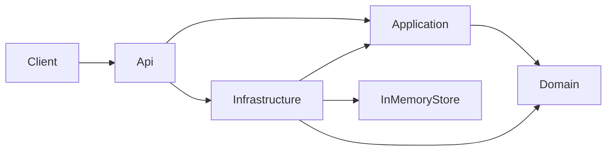
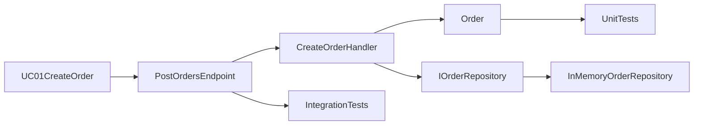

# Przegląd architektury systemu

## Cel systemu

System pokazuje minimalny, ale działający przykład projektu warstwowego w .NET. Celem jest zachowanie czytelnego przepływu od przypadku użycia do implementacji bez nadmiernej złożoności.

---

## Styl architektury

Szablon korzysta z lekkiego podejścia inspirowanego **Clean Architecture**:

- logika biznesowa pozostaje w `Domain`,
- przypadki użycia są realizowane w `Application`,
- `Api` składa aplikację i wystawia endpointy,
- `Infrastructure` implementuje szczegóły techniczne.

Najważniejsza zasada: logika biznesowa nie powinna zależeć od szczegółów infrastruktury.

---

## Diagram zależności

W tym układzie `Api` zna warstwę `Infrastructure`, bo to tutaj odbywa się kompozycja zależności. `Domain` nie zależy od `Infrastructure`.

---

## Mapowanie dokumentacji na kod

Referencyjny przepływ dla `UC-01` wygląda tak:

To jest podstawowy wzorzec przepływu dla aktualnej implementacji.

---

## Warstwy systemu

### API

Warstwa komunikacji z klientem.

Zawiera:

- endpointy HTTP,
- mapowanie żądań na przypadki użycia,
- składanie zależności.

### Application

Warstwa realizująca przypadki użycia systemu.

Zawiera:

- komendy i modele odpowiedzi,
- handlery use case,
- kontrakty potrzebne do współpracy z infrastrukturą.

### Domain

Warstwa modelu domenowego i reguł biznesowych.

Zawiera:

- agregat `Order`,
- element `OrderItem`,
- enum `OrderStatus`.

### Infrastructure

Warstwa szczegółów technicznych.

Obecnie zawiera prostą implementację repozytorium w pamięci. To pozwala utrzymać niski poziom złożoności przy zachowaniu czytelnej struktury.