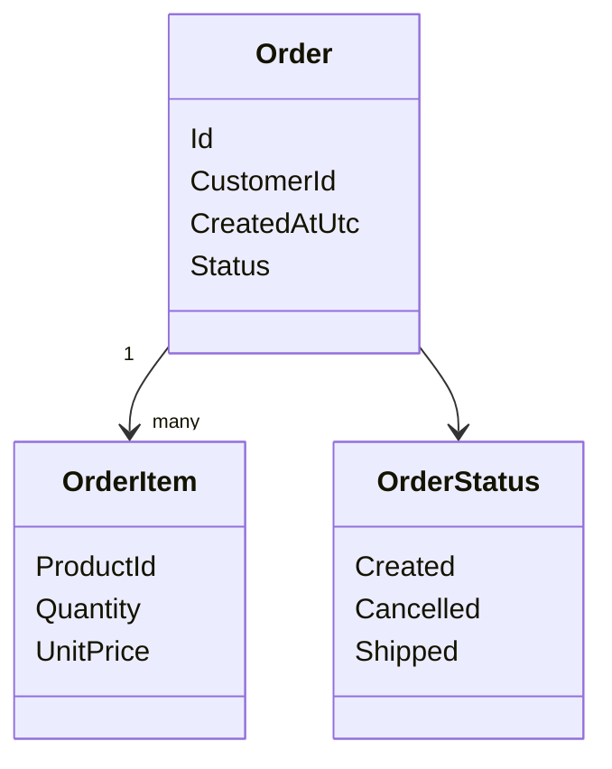

# Model domenowy

## Opis domeny

Przykład dotyczy prostego systemu do zarządzania zamówieniami klientów. Obecna implementacja obejmuje pierwszy pionowy wycinek: utworzenie zamówienia.

Każde zamówienie składa się z jednej lub wielu pozycji. Na potrzeby prostego startu dane produktu są przechowywane bezpośrednio w pozycji zamówienia przez `ProductId` i `UnitPrice`.

---

## Diagram klas

---

## Elementy modelu

### Order

Agregat reprezentujący zamówienie klienta.

Odpowiada za:

- utworzenie poprawnego zamówienia,
- przechowanie listy pozycji,
- pilnowanie statusu zamówienia.

Główne atrybuty:

- `Id`
- `CustomerId`
- `CreatedAtUtc`
- `Status`
- `Items`

### OrderItem

Pojedyncza pozycja zamówienia.

Główne atrybuty:

- `ProductId`
- `Quantity`
- `UnitPrice`

W obecnej wersji pozycja zawiera dane wystarczające do opisania logiki biznesowej bez budowania osobnego modułu katalogu produktów.

### OrderStatus

Prosty enum opisujący stan zamówienia:

- `Created`
- `Cancelled`
- `Shipped`

---

## Relacje

- `Order` zawiera wiele `OrderItem`.
- `OrderStatus` opisuje aktualny stan `Order`.

---

## Zasady biznesowe

- zamówienie musi mieć klienta,
- zamówienie musi mieć co najmniej jedną pozycję,
- ilość i cena w pozycji muszą być większe od zera,
- wysłanego zamówienia nie można anulować.
